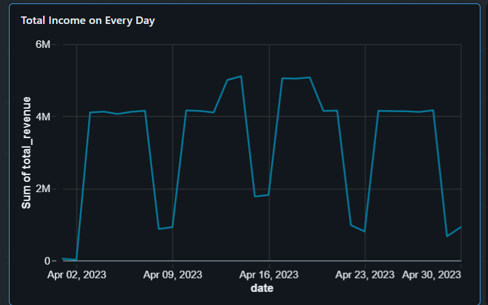
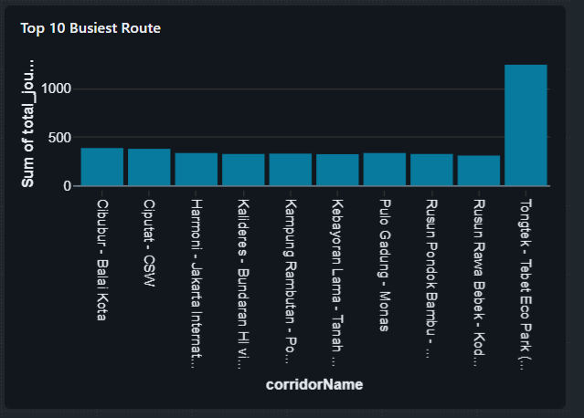
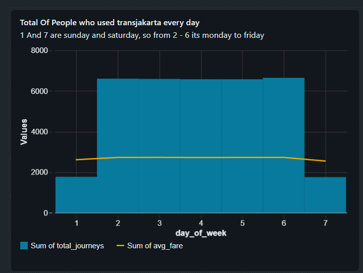
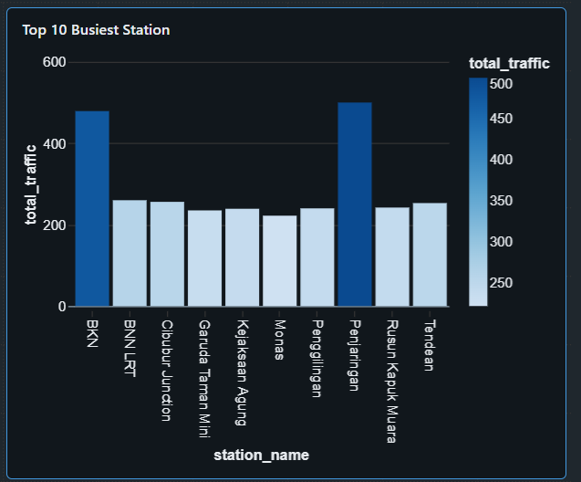

# TransJakarta Public Transport Pipeline
### End-to-End Medallion Architecture on Databricks


---

## Overview

This project builds a production-grade data pipeline for TransJakarta — Jakarta's public Bus Rapid Transit (BRT) system, one of the largest in Southeast Asia. The dataset contains passenger tap-in and tap-out records capturing every journey made across the network.

The pipeline follows the **Medallion Architecture** (Bronze → Silver → Gold) implemented entirely on **Databricks** using **PySpark** and **Delta Lake**, with **Unity Catalog** managing the data governance layer. The end result is an analytics-ready Gold layer that answers real operational questions about the TransJakarta network.

---

## Architecture

```
Raw CSV (Kaggle)
      │
      ▼
┌─────────────┐
│   BRONZE    │  Raw ingestion — data landed as-is into Delta
└──────┬──────┘
       │
       ▼
┌─────────────┐  Schema enforcement, null handling,
│   SILVER    │  deduplication, quality flagging,
└──────┬──────┘  audit metadata
       │
       ▼
┌─────────────┐  Business logic, journey enrichment,
│    GOLD     │  aggregations, analytics-ready tables
└──────┬──────┘
       │
       ▼
┌─────────────┐
│  ANALYTICS  │  Databricks dashboards answering
└─────────────┘  operational business questions
```

---

## Tech Stack

| Tool | Purpose |
|---|---|
| Databricks | Cloud data platform and compute |
| PySpark | Distributed data processing |
| Delta Lake | ACID-compliant storage format |
| Unity Catalog | Data governance and three-part naming |
| Python | Pipeline scripting |

---

## Dataset

**Source**: [TransJakarta Dataset — Kaggle](https://www.kaggle.com/datasets/dikisahkan/transjakarta-transportation-transaction)

**Description**: Passenger tap-in/tap-out records from the TransJakarta BRT network for April 2023. Each row represents one journey attempt, containing passenger info, corridor details, station origin/destination, timestamps, and payment amount.

**Key columns**: `transID`, `payCardID`, `corridorID`, `corridorName`, `tapInStops`, `tapInStopsName`, `tapOutStops`, `tapOutStopsName`, `tapInTime`, `tapOutTime`, `payAmount`

---

## Pipeline Layers

### Bronze — Raw Ingestion

The Bronze layer lands the raw CSV data into a Delta table with zero transformation. The goal is to preserve the source data exactly as received — no filtering, no cleaning, no business logic.

**What happens here:**
- CSV ingested from source
- Written to Delta with schema inference
- Audit columns added: `ingestion_timestamp`, `source_file`

**Output table**: `transjakarta_dataset.bronze.transjakarta_raw`

---

### Silver — Data Quality

The Silver layer applies structural data quality. The rule here is strict: Silver makes data trustworthy, it does not make business decisions.

**What happens here:**
- Schema enforcement on all columns
- Null handling — safe fills applied where possible (e.g. corridor names forward-filled via window functions)
- Unresolvable records flagged with `data_quality_flag = 'MISSING_TAP_OUT'` — never dropped
- Deduplication on `transID`
- Timestamp columns cast to proper `TimestampType`
- Audit columns added: `silver_processed_at`, `pipeline_version`

**Design decision**: Rows with missing tap-out cannot be resolved at the Silver layer — we don't know the passenger's destination. They are flagged and passed downstream. The decision of what to do with them belongs to Gold.

**Output table**: `transjakarta_dataset.silver.transjakarta_raw`

---

### Gold — Business Logic & Aggregations

The Gold layer applies business meaning to the clean Silver data. This is where the pipeline splits into purpose-built tables, each answering a specific operational question.

**Step 1 — Route flagged records**

Silver's `data_quality_flag` column is used to split the data:

```
Silver data
    │
    ├── flag IS NULL     → clean_df  (continues through pipeline)
    └── flag IS NOT NULL → incomplete_journeys Gold table (parked immediately)
```

Incomplete journeys are not discarded — they land in their own Gold table for auditability and future analysis.

**Step 2 — Journey enrichment (row-level)**

Applied to `clean_df` — each row gets new columns without changing the grain:

- `journey_status`: `COMPLETE` (all clean records by definition)
- `journey_duration_seconds`: `(tapOutTime - tapInTime).cast("long")`
- `journey_duration_minutes`: rounded to 2 decimal places
- `duration_validity`: flags any negative durations as `INVALID_DURATION`

**Step 3 — Aggregate tables**

Four aggregate tables built from `clean_df`, each at a different grain:

| Table | Grain | Answers |
|---|---|---|
| `revenue_daily` | Per day | Total revenue and journey count per day |
| `route_traffic` | Per day + corridor | Which routes are busiest and when |
| `traffic_by_day` | Per day of week | Weekly rhythm, weekend vs weekday patterns |
| `station_footfall` | Per station | Most crowded stations by total tap-in + tap-out |

**Output tables**:
- `transjakarta_dataset.gold.incomplete_journeys`
- `transjakarta_dataset.gold.revenue_daily`
- `transjakarta_dataset.gold.route_traffic`
- `transjakarta_dataset.gold.traffic_by_day`
- `transjakarta_dataset.gold.station_footfall`

---

## Analytics

Four dashboards built in Databricks querying Gold tables directly:

| Dashboard | Chart Type | Key Insight |
|---|---|---|
| Daily revenue trend | Line chart | Revenue performance over the month |


| Top 10 busiest Route g | Bar chart | Which corridors need more bus capacity |


| Traffic by day of week | Grouped bar chart | Peak days and weekend vs weekday split |


| Top 10 busiest stations |  bar chart | Stations requiring operational attention |


---

## Project Structure

```
transjakarta-pipeline/
├── README.md
├── notebooks/
│   ├── 01_bronze.py       # Raw ingestion
│   ├── 02_silver.py       # Data quality layer
│   └── 03_gold.py         # Business logic and aggregations
└── assets/
    └── screenshots/       # Dashboard screenshots
```

---

## Key Design Decisions

**Layer responsibility boundaries are strict.** Silver handles structural data quality — it fills where safe, flags what it can't resolve, and never drops rows. Business logic decisions (what to do with flagged records, how to classify journeys, how to compute fares) belong exclusively in Gold. This separation keeps each layer independently testable and maintainable.

**Incomplete journeys are never dropped.** Records with missing tap-out are flagged in Silver and routed to a dedicated Gold table. This preserves full data lineage and gives analysts visibility into data loss rates across the network.

**Separate aggregate tables per business question.** Each Gold aggregate table has a single, well-defined grain. Mixing aggregations at different grains into one table creates ambiguity and forces downstream consumers to re-aggregate. Purpose-built tables are faster to query and easier to reason about.

---

## How to Run

1. Upload the TransJakarta dataset CSV to your Databricks workspace
2. Create a Unity Catalog with the namespace `transjakarta_dataset`
3. Run notebooks in order: `01_bronze` → `02_silver` → `03_gold`
4. Query Gold tables in Databricks SQL to build dashboards

---

## Author

**Kennys** — Aspiring Data Engineer based in Jakarta, Indonesia.
Building production-realistic data pipelines with a long-term goal of ML Engineering.

[](https://github.com/kennys21)
[](https://linkedin.com/in/Kennys1)
