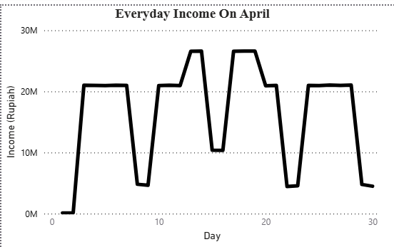
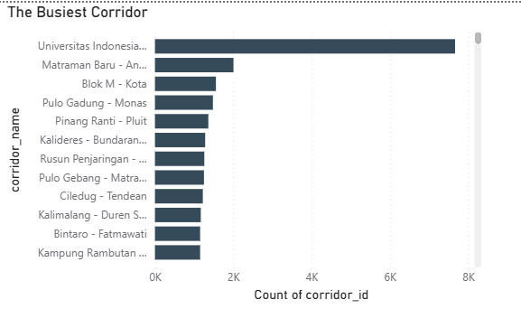
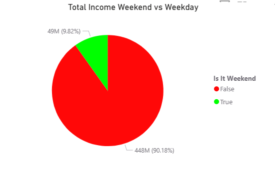
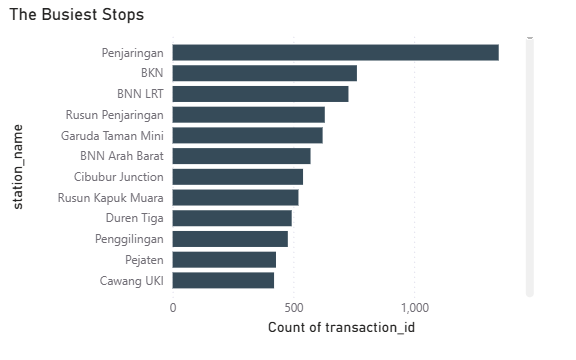

# TransJakarta Public Transport Pipeline
### End-to-End Medallion Architecture (PySpark + dbt + Databricks)


---

## Overview

This project builds a production-grade data pipeline for TransJakarta — Jakarta's public Bus Rapid Transit (BRT) system. The dataset contains millions of passenger tap-in and tap-out records, capturing journey data across the network.

The pipeline implements a hybrid **Medallion Architecture**. **PySpark** handles the initial raw data ingestion into the cloud (Bronze), while **dbt (data build tool)** manages data standardization (Silver) and engineers a fully normalized, Kimball-style Star Schema for the analytical reporting layer (Gold). The entire ecosystem is hosted on **Databricks** using **Delta Lake**, with **Unity Catalog** governing the assets. 

This architecture guarantees that the final reporting layer is not just clean, but fully tested, documented, and optimized for BI workloads.

---

## Architecture
```text
Raw CSV (Kaggle)
      │
      ▼
┌─────────────┐
│   BRONZE    │  PySpark: Raw ingestion — data landed as-is into Delta
└──────┬──────┘
       │
       ▼
┌─────────────┐  dbt: Data standardization (Staging)
│   SILVER    │  Schema enforcement, data type casting, column renaming
└──────┬──────┘  
       │
       ▼
┌─────────────┐  dbt: Dimensional modeling (Star Schema)
│    GOLD     │  fct_transaction + dim_station, dim_date, dim_cards, dim_corridor
└──────┬──────┘  Rigorous YAML testing (not_null, unique, relationships)
       │
       ▼
┌─────────────┐
│  ANALYTICS  │  Databricks dashboards answering
└─────────────┘  operational business questions
```

---

## Tech Stack

| Tool | Purpose |
|---|---|
| **Databricks** | Cloud data platform and compute cluster |
| **PySpark** | Distributed data ingestion (Bronze layer) |
| **dbt Core** | Data transformation, staging (Silver layer), dimensional modeling, and testing (Gold layer) |
| **Delta Lake** | ACID-compliant storage format |
| **Unity Catalog** | Data governance and three-part naming |

---

## Dataset

**Source**: [TransJakarta Dataset — Kaggle](https://www.kaggle.com/datasets/dikisahkan/transjakarta-transportation-transaction)

**Description**: Passenger tap-in/tap-out records from the TransJakarta BRT network. Each row represents one journey attempt, containing passenger info, corridor details, station origin/destination, timestamps, and payment amount.

---

## Pipeline Layers

### 🥉 Bronze — Raw Ingestion (PySpark)
Extracts the raw CSV data and loads it into a Delta table with zero transformation. This layer acts as an immutable historical archive, preserving the source data exactly as received.
- **Output**: `transjakarta_dataset.bronze.transjakarta_raw`

### 🥈 Silver — Data Standardization (dbt Staging)
Applies structural data quality and standardization via dbt staging models. This layer acts as the clean foundation for downstream modeling.
- Explicit data type casting (e.g., parsing raw strings into `TIMESTAMP` and `DATE` types).
- Column nomenclature standardization.
- **Output**: `stg_transjakarta` (dbt staging view)

### 🥇 Gold — The Star Schema (dbt Marts)
The analytical powerhouse of the pipeline. Built using dbt to transform the flat Silver views into a scalable dimensional model optimized for BI.

**Fact Table:**
- `fct_transaction`: The core event log recording individual transit journeys. Contains measurable metrics (`payment_amount`) and foreign keys. Implements Role-Playing Dimensions by mapping both `tap_in_id` and `tap_out_id` to the station dimension independently.

**Dimension Tables:**
- `dim_station`: Master geography dimension constructed using a `UNION ALL` operation to merge all tap-in and tap-out locations. Kept as a pure geographic entity to prevent cardinality conflicts. Integrates data quality safeguards to reclassify system glitch IDs into valid "Unknown" rows.
- `dim_corridor`: Normalized route dimension detailing the specific bus lines and transit corridors.
- `dim_cards`: Unique customer transit cards.
- `dim_date`: Calendar dimension derived from raw timestamps. Pre-calculates business logic (e.g., `is_weekend`) to eliminate redundant date math in downstream BI dashboards.

**Data Testing & CI/CD:**
The Gold layer is strictly governed by dbt YAML tests to ensure data integrity:
- **Primary Key Integrity:** `unique` and `not_null` constraints on all Dimension tables.
- **Referential Integrity:** `relationships` tests on all Fact table foreign keys to guarantee mapping to valid Dimension records.
- **Categorical Validation:** `accepted_values` checks on demographic data.

---

## Analytics

Dashboards built in Databricks querying the dbt Gold tables directly:


| Dashboard | Key Insight |
|---|---|
| **Daily Revenue Trend** | Revenue performance over the Day In April |
| **The Busiest Corridor** | Which corridors need more bus capacity |
| **Total Income Weekend vs Weekday** | People Who Go To Work In Weekday Is The Main Source Of Income |
| **The Busiest Stops** | Stops requiring operational attention Cause Of The Crowd |






---

## Project Structure & Code

Below is the complete dbt architecture used to build the Gold layer.

### Directory Structure
```text
transjakarta-pipeline/
├── README.md
├── 01_ingesting_to_raw.ipynb      # PySpark Bronze ingestion
├── dbt_project.yml                # dbt configuration
└── models/
    ├── staging/
    │   ├── src_transjakarta.yml   # Source definitions
    │   └── stg_transjakarta.sql   # Base staging views (Silver Layer)
    └── marts/                     # Gold Layer
        ├── dim_cards.sql          # Dimension: Cards
        ├── dim_corridor.sql       # Dimension: Corridor
        ├── dim_date.sql           # Dimension: Calendar
        ├── dim_station.sql        # Dimension: Stations
        ├── fct_transaction.sql    # Fact: Trips
        └── schema.yml             # dbt Tests & Documentation
```

---

### 1. `models/marts/dim_station.sql`
```sql
WITH all_stations AS (
    -- The Tap-In Pipe
    SELECT
        tap_in_latitude AS station_latitude,
        tap_in_longitude AS station_longitude,
        tap_in_id AS station_id,
        tap_in_name AS station_name
    FROM {{ ref('stg_transjakarta') }}

    UNION ALL

    -- The Tap-Out Pipe
    SELECT
        tap_out_latitude AS station_latitude,
        tap_out_longitude AS station_longitude,
        tap_out_id AS station_id,
        tap_out_name AS station_name
    FROM {{ ref('stg_transjakarta') }}
),

deduplicated_station AS (
    -- The Aggregation Squeeze
    SELECT
        station_id,
        CASE 
            WHEN station_id = '-1' THEN 'Unknown/Glitch Station'
            ELSE MAX(station_name) 
        END AS station_name,
        MAX(station_latitude) AS station_latitude,
        MAX(station_longitude) AS station_longitude
    FROM all_stations
    WHERE station_id IS NOT NULL
    GROUP BY station_id
)

SELECT * FROM deduplicated_station
```

---

### 2. `models/marts/dim_corridor.sql`
```sql
WITH deduplicated_corridors AS (
    SELECT 
        corridor_id, 
        MAX(corridor_name) AS corridor_name
    FROM {{ ref('stg_transjakarta') }}
    WHERE corridor_id IS NOT NULL
    GROUP BY corridor_id
)

SELECT * FROM deduplicated_corridors
```

---

### 3. `models/marts/dim_date.sql`
```sql
WITH raw_dates AS (
    SELECT CAST(tap_in_time AS DATE) AS date_day 
    FROM {{ ref('stg_transjakarta') }}
    WHERE tap_in_time IS NOT NULL

    UNION 

    SELECT CAST(tap_out_time AS DATE) AS date_day 
    FROM {{ ref('stg_transjakarta') }}
    WHERE tap_out_time IS NOT NULL
)

SELECT
    date_day AS date_key,
    YEAR(date_day) AS year,
    MONTH(date_day) AS month,
    DAY(date_day) AS day,
    DATE_FORMAT(date_day, 'EEEE') AS day_name,
    CASE 
        WHEN DAYOFWEEK(date_day) IN (1, 7) THEN True 
        ELSE False 
    END AS is_weekend
FROM raw_dates
WHERE date_day IS NOT NULL
ORDER BY date_key
```

---

### 4. `models/marts/fct_transaction.sql`
```sql
WITH final_facts AS (
    SELECT
        transaction_id,
        card_id,
        CAST(tap_in_time AS DATE) AS date_key,
        corridor_id,
        tap_in_id,
        tap_out_id,
        customer_gender,
        CAST(payment_amount AS INT) AS payment_amount
    FROM {{ ref('stg_transjakarta') }}
    WHERE transaction_id IS NOT NULL
)

SELECT * FROM final_facts
```

---

### 5. `models/marts/schema.yml`
```yaml
version: 2

models:
  # --- DIMENSION: CARDS ---
  - name: dim_cards
    description: "dimension table for customer cards"
    columns:
      - name: card_id
        description: "the unique card ID for every customer"
        tests:
          - unique:
              config: 
                severity: error
                store_failures: true
          - not_null:
              config:
                severity: error
                store_failures: true
  
  # --- DIMENSION: CORRIDOR ---
  - name: dim_corridor
    description: "dimension table for transit routes"
    columns:
      - name: corridor_id
        description: "the unique ID for every bus route"
        tests:
          - unique:
              config: 
                severity: error
                store_failures: true
          - not_null:
              config:
                severity: error
                store_failures: true

  # --- DIMENSION: STATIONS ---
  - name: dim_station
    description: "dimension table for every station"
    columns:
      - name: station_id
        description: "the unique station ID for every station"
        tests:
          - unique:
              config: 
                severity: error
                store_failures: true
          - not_null:
              config:
                severity: error
                store_failures: true
  
  # --- DIMENSION: DATES ---
  - name: dim_date
    description: "dimension table for dates"
    columns:
      - name: date_key
        description: "the unique day for every data"
        tests:
          - unique:
              config: 
                severity: error
                store_failures: true
          - not_null:
              config:
                severity: error
                store_failures: true
  
  # --- FACT: TRANSACTIONS ---
  - name: fct_transaction
    description: "fact table for every trip that happens"
    columns:
      - name: transaction_id
        description: "the transaction ID for every transaction"
        tests:
          - unique:
              config: 
                severity: error
                store_failures: true
          - not_null:
              config:
                severity: error
                store_failures: true
                
      - name: customer_gender
        description: "the gender for every customer"
        tests:
          - accepted_values:
              arguments:
                values: ['M','F']
              config: 
                where: "customer_gender IS NOT NULL"
                severity: warn
                store_failures: true
                
      - name: corridor_id
        tests:
          - not_null       
          - relationships: 
              arguments:
                to: ref('dim_corridor')
                field: corridor_id

      - name: tap_in_id
        tests:
          - not_null       
          - relationships: 
              arguments:
                to: ref('dim_station')
                field: station_id
                
      - name: tap_out_id
        tests:
          - not_null       
          - relationships: 
              arguments:
                to: ref('dim_station')
